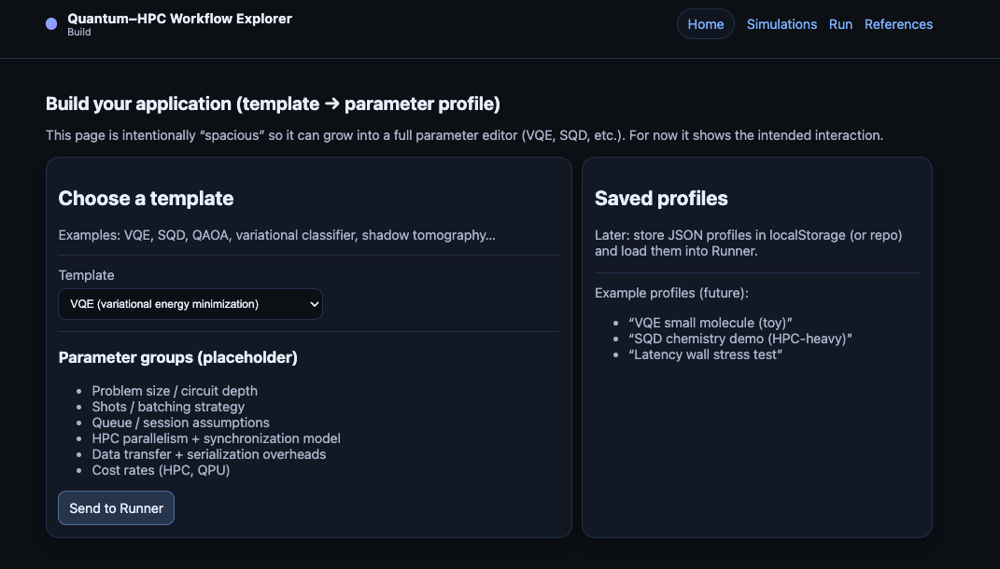

# Workflow Builder 

The **Workflow Builder** is a tool that allows the user to describe a *custom hybrid quantum–HPC workflow* and specify the input parameters required to run the corresponding workflow within the Explorer. It provides a blueprint that the Explorer uses to model execution flow, timing, and resource interaction.

This allows the user to explore their own application scenarios. Future versions will also provide the option to store the custom scenarios for later reuse.

This tool is under active development and will evolve as additional features are implemented.

---

## Templates and parameters

The Builder offers multiple **workflow templates** as starting points which are designed with common use cases like VQE or SQD in mind. These templates encode common workflow structures that define the sequence of classical and quantum jobs. The user can then specify important parameters that will determine the performance of the workflow, such as:
  - number of classical ranks
  - synchronization or blocking behavior
  - approximate runtime for classical phases
  - estimated quantum job duration
  - cost assumptions for HPC and QPU usage

These parameters define the structure and scale of the workflow and serve as the input for execution modeling in the Explorer. They can be dynamically adjusted during the run to observe how changes affect execution flow and resource utilization.

---

## Builder interface overview

  

The current Builder page is organized as follows:
- **Template selection**: At the top, users can choose from a set of predefined workflow templates that represent common hybrid quantum–HPC patterns. This choice initializes the basic structure and parameters of the workflow.
- **Parameter input fields**: Below the template selector, users can input key parameters that define the workflow's execution characteristics.
- **Saved profiles**: Future implementations will allow users to save and choose from previously defined workflow profiles for easy reuse.

---

## Scope and modeling philosophy

The Builder does **not** aim to model every optimization or micro-decision.

Early versions intentionally focus on:
- rank counts
- timelines
- blocking behavior
- coarse runtime and cost estimates

More detailed concerns (such as batching strategies) primarily affect *quantum execution time*, which users already provide as an estimate. 

The goal at this point is to enable meaningful exploration with the **fewest necessary assumptions** to help users build intuition for how a small number of parameters affect the performance of their own applications.

---

## Next step

Once a workflow blueprint is defined, it can be passed to the Explorer to visualize execution flow and observe how architectural choices affect time, utilization, and cost.

