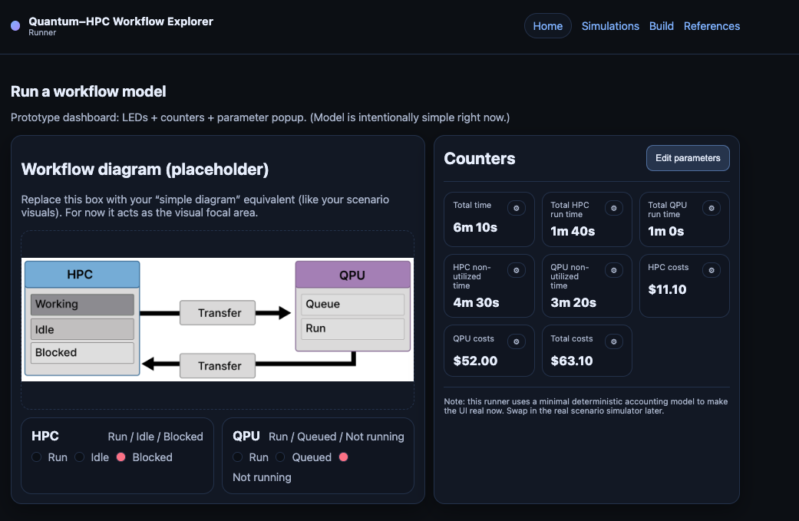

# Workflow Explorer

The **Workflow Runner** is the part of the Workflow Explorer where a workflow *blueprint* is executed as a **visual model**.

You can think of it as a lightweight “flight simulator” for hybrid quantum–HPC orchestration: instead of producing exact predictions, it helps you **reason about time, utilization, and cost** under common bottlenecks (queueing, latency, synchronization, and blocking).

> **Status:** This page is a functional prototype and will evolve as features are implemented and validated.

---

## What the Runner is for

After you define a workflow in the **Builder**, the Runner lets you:

- **Visualize execution flow** across HPC and QPU components (what runs, what waits, what blocks).
- **Identify bottlenecks** (idle time, blocked ranks, queue buildup, barrier stalls).
- **Explore tradeoffs** by changing a small set of parameters and observing how outcomes change.
- **Build intuition for your own project**: not “the one correct answer,” but a clearer sense of which design decisions matter most.

---

## Runner interface overview

  

The Runner is organized into three main areas:

1. **Workflow diagram**
   - A visual representation of the workflow template and its control flow.
   - Emphasizes where quantum jobs are submitted and where synchronization / waiting can occur.

2. **Live indicators and counters**
   - Simple “dashboard” indicators (e.g., queue depth, working vs. idle vs. blocked ranks).
   - Designed to make bottlenecks obvious at a glance.

3. **Controls and parameters**
   - Start/stop controls and speed controls.
   - Parameter inputs that influence the run (timelines, rank counts, queue/latency assumptions, coarse cost settings).

---

## How to use the Runner

### 1) Start from a template blueprint
Most runs begin by selecting a template in the **Builder** and filling in the required parameters (rank count, timing estimates, blocking behavior, cost assumptions). The Builder output provides the initial configuration for the Runner.

### 2) Run the model and observe the flow
Start the run and watch how work moves through the system:
- when ranks compute
- when they wait or block
- when the queue grows or shrinks
- when synchronization points stall progress

### 3) Adjust parameters and compare outcomes
Change one parameter at a time to build intuition. Useful “first experiments” include:
- increasing the number of ranks (and watching queue pressure grow)
- changing quantum job duration or queue time
- changing synchronization frequency / barrier behavior
- changing latency assumptions

---

## Interpreting what you see

The Runner is intentionally **coarse**. It is designed to show *patterns* rather than predict exact timelines.

A few rules of thumb:
- If the **QPU queue grows**, the workflow becomes QPU-limited (even if classical work scales).
- If **idle or blocked ranks dominate**, orchestration choices and synchronization points are likely the limiting factor.
- If the run is dominated by a short number of infrequent quantum calls, orchestration overhead may matter less than algorithmic structure.

---

## Next steps

- Use the **Scenario Animations** to learn and recognize common orchestration patterns.
- Use the **Builder** to define a workflow blueprint that resembles your own application.
- Use the **Runner** to compare architectural choices and develop intuition about time/cost/utilization tradeoffs.

---