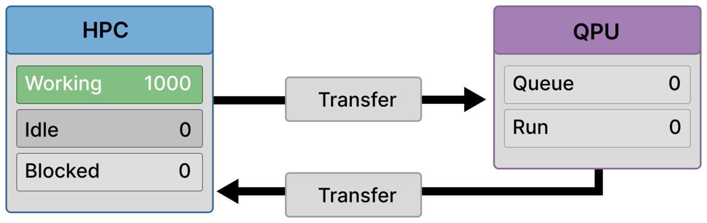
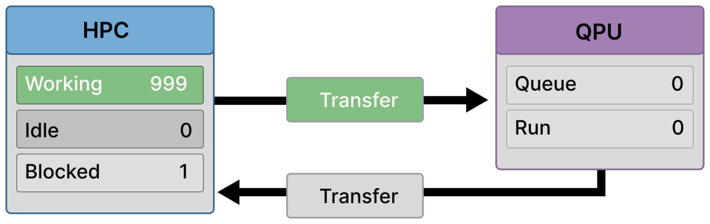
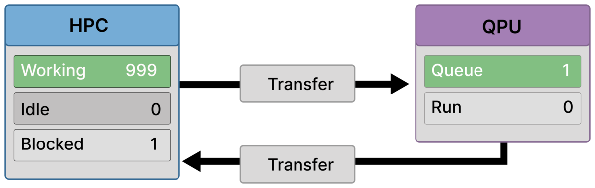
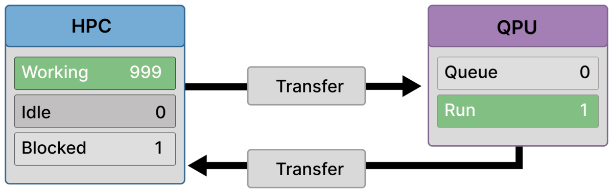
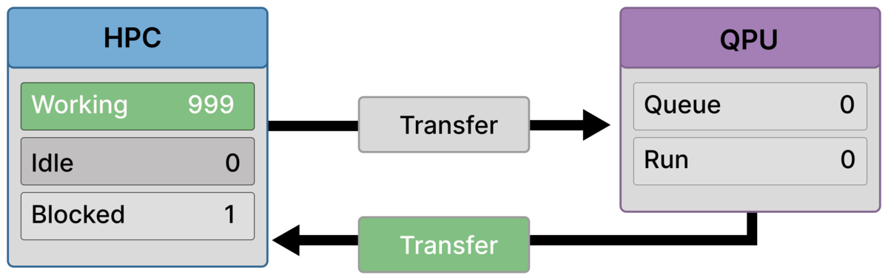
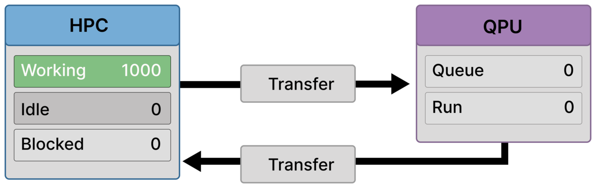

# Scenario A
## Idealized Baseline (Loosely Coupled Workflow)

Scenario A illustrates a hybrid Quantum–HPC workflow in which **quantum execution is present but non-disruptive**. Classical computation dominates runtime, quantum calls are infrequent, and no structural bottleneck limits overall progress.

This scenario serves as a **reference configuration**: it shows how a hybrid system behaves when none of the common failure modes—synchronization, latency, or throughput limits—are active. Classical and quantum work are loosely coupled and overlap cleanly, without introducing dominant bottlenecks.

---

## Purpose of This Scenario

Scenario A shows:

- How a hybrid workflow *looks* when no single constraint dominates
- What “good overlap” between HPC and QPU execution means conceptually
- A baseline against which synchronization, latency, and throughput limits can be contrasted

The purpose is not realism, but clarity. Later scenarios intentionally violate one or more of the assumptions established here.

---

## What characterizes this workflow

In this scenario, quantum execution is **loosely coupled** to classical execution:

- Quantum jobs are triggered by individual ranks
- Results are consumed locally
- No rank depends on global quantum state to proceed
- The QPU is never a shared coordination point

As a result, quantum execution does not appear on the critical path of the HPC workload.

---

## Bottlenecks

There is **no dominant bottleneck** in this scenario.

- **No synchronization bottleneck**  
  No global barrier forces ranks to wait for quantum results.

- **No latency bottleneck**  
  Data transfer and control overhead are negligible relative to classical computation.

- **No throughput bottleneck**  
  Quantum submission rate remains far below QPU service capacity.

This is the only scenario in which it is legitimate to say that *nothing structural is slowing the system down*.

---

## Assumptions that matter

Scenario A relies on a narrow but explicit set of assumptions.

### Algorithmic structure
- Hybrid algorithm with long classical phases
- Quantum calls are infrequent and optional
- Each quantum result affects only the submitting rank

### Timing regime
- Classical work dominates overall runtime
- Quantum execution time is short relative to classical work
- Network transfer latency is negligible

### HPC execution model
- Many ranks execute classical work concurrently
- A rank submitting a quantum job does not stall others
- Submission temporarily blocks the submitting rank (it cannot continue classical work until its quantum result returns), but it does not block progress elsewhere.

### Quantum execution model
- Single-lane (serial) QPU execution
- At most one quantum job is active or queued at any time
- No admission control or throttling is required

Violating any one of these assumptions leads directly to Scenarios B–D.

---

## Frame-by-Frame Walkthrough

### Frame 1 — Classical steady state

  

All HPC ranks are performing classical computation.  
No quantum jobs are active. The QPU is idle.

This represents a long classical phase (e.g., preprocessing or local computation).

---

### Frame 2 — Single submission

  

One rank finishes a classical step and submits a quantum job.  
That rank becomes **Blocked** (waiting on its own quantum call) while the job is transferred and executed.

Crucially, no other rank is affected.

---

### Frame 3 — Job arrives at QPU

  

The quantum job arrives at the QPU and enters execution.  
There is no queue buildup.

The HPC side continues uninterrupted.

---

### Frame 4 — Quantum execution overlaps with classical work

  

Quantum execution proceeds while nearly all HPC ranks remain **Working**.

This overlap is the defining feature of Scenario A: quantum execution does not reduce aggregate classical throughput.

---

### Frame 5 — Result returns

  

The quantum result is transferred back.  
The result returns and unblocks the submitting rank, which resumes classical work immediately. The QPU becomes idle.

---

### Frame 6 — Restored equilibrium

  

The system returns to its initial state:

- All HPC ranks working
- No idle or blocked ranks
- QPU idle, awaiting the next infrequent submission

The workflow shows no visible memory of having invoked quantum execution.

---

## Why This Scenario Matters

Scenario A establishes a **baseline mental model**:

- What clean overlap looks like
- What it means for quantum to be off the critical path
- Which assumptions must hold for that to remain true

Every later scenario can be read as a controlled failure of one or more of these assumptions.

---

## Where this scenario actually appears

Scenario A loosely corresponds to:

- Toy or demonstration workflows
- Exploratory hybrid experiments
- One-off quantum calls embedded in large classical analyses
- Educational examples designed to illustrate hybrid structure

It does **not** describe scalable production hybrid workloads.

---

## Takeaway

Scenario A shows a hybrid Quantum–HPC workflow in which quantum execution is present but structurally irrelevant to system performance.

It is a reference point, not a goal — and its fragility is precisely why the other scenarios matter.