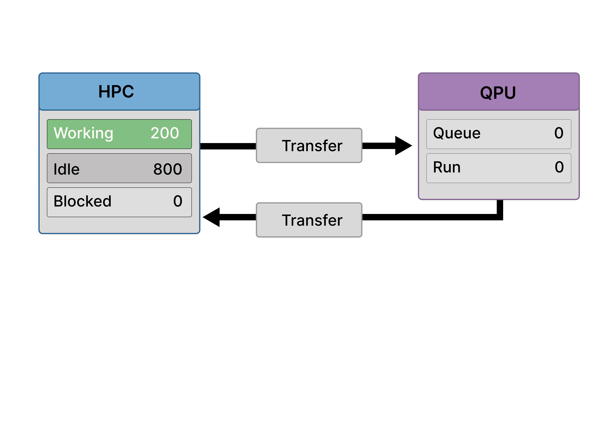
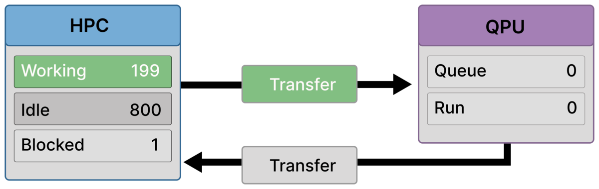
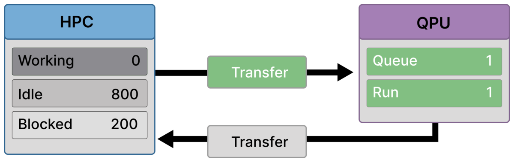
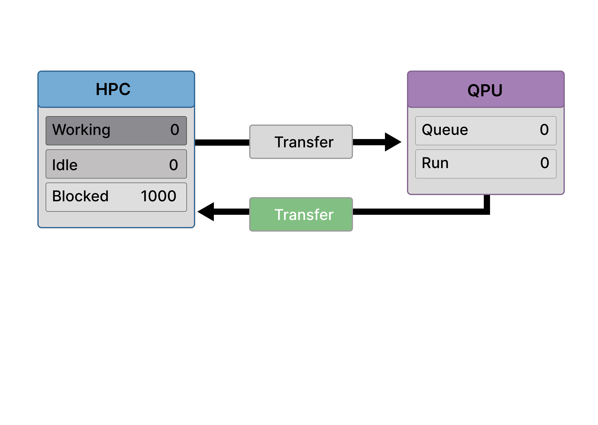
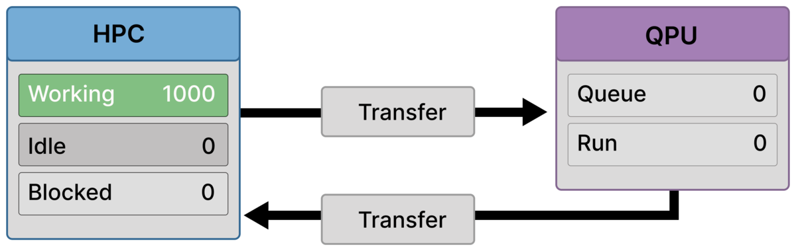

# Scenario B — Synchronization Wall (Globally Coupled Workflow)

Scenario B illustrates a hybrid Quantum–HPC workflow in which **classical progress is gated by a global quantum dependency**.  
The structure closely resembles a **VQE-style iteration**, with one deliberate simplification: quantum executions are abstracted into a single serialized phase, without queue buildup, to isolate synchronization effects.

The defining feature of this scenario is not limited quantum capacity, but **algorithmic coordination**: classical execution is forced to wait until a globally complete quantum result is available.

---

## Purpose of This Scenario

Scenario B shows:

- How global synchronization arises in realistic hybrid algorithms such as VQE
- Why uneven classical workloads naturally emerge across phases
- How a quantum phase can block **all** classical ranks, including those that never submitted quantum jobs

Compared to Scenario A, exactly one rule changes:

> **The next classical phase depends on a globally aggregated quantum result.**

That rule alone is sufficient to introduce a system-wide stall.

---

## What characterizes this workflow

Scenario B follows a repeated execution pattern of the form:
- **Classical preparation** (subset of ranks)  
- **Quantum evaluation** (serialized phase)  
- **Classical aggregation / optimization** (all ranks)

In this scenario:

- Only a fraction of ranks (e.g. ~200) participate in quantum circuit preparation and submission
- Quantum execution is serialized and abstracted as a single phase
- Subsequent optimization and aggregation require participation from **all** ranks (e.g. 1000)

Once local preparation work is exhausted, **no rank may proceed independently**, because correctness requires that all quantum results be available before optimization begins.

---

## Bottleneck

The dominant bottleneck in this scenario is **global synchronization**.

- **Synchronization wall**  
  Classical execution stalls collectively while waiting for completion of the quantum phase.

This stall is not caused by backend congestion or poor scheduling.  
It is imposed by **algorithmic dependency**.

---

## Assumptions and constraints

### Algorithmic structure
- Iterative hybrid algorithm with global parameter updates
- Each iteration requires a complete quantum evaluation
- Partial quantum results are insufficient to proceed

### Classical execution
- Early classical work (e.g. circuit preparation) involves only a subset of ranks
- Later classical work (e.g. aggregation, optimization) involves the full allocation
- Classical work that would extend past the quantum dependency is intentionally avoided

### Quantum execution
- Serialized execution model
- Many circuits may be executed per iteration
- The diagrams intentionally suppress queue buildup to avoid mixing synchronization effects with service-capacity limits (addressed in Scenario D)

This reflects VQE-like workflows in which **circuit preparation is parallel**, but **learning is globally synchronized**.

---

## Frame-by-Frame Walkthrough

### Frame 1 — Uneven classical progress

  

A subset of ranks is actively preparing quantum circuits.  
Other ranks are idle because the preparation workload is small relative to available classical resources.

No quantum execution is active yet.

---

### Frame 2 — Quantum submission begins

  

Prepared quantum work is submitted.  
Submitting ranks become **Blocked** while awaiting results.

Ranks that finished preparation earlier remain idle.

---

### Frame 3 — Quantum phase active, dependency exposed

  

The quantum phase is active.  
All classical preparation is complete.

At this point, classical progress is no longer possible: the next valid step requires the **entire quantum result set**.

---

### Frame 4 — Full synchronization wall

  

All HPC ranks are blocked at a global barrier.

This includes ranks that never submitted quantum jobs themselves.  
Blocking propagates through algorithmic dependency, not through job submission.

---

### Frame 5 — The last result returns

  

The final quantum result required for this iteration is transferred back. 
The global dependency is resolved.

---

### Frame 6 — Collective recovery

  

All ranks resume classical execution simultaneously.  
The workflow enters the collective optimization phase.

The same synchronization pattern will recur in the next iteration.

---

## Why ranks are idle — and why this is intentional

Ranks are idle in this scenario **by design**, not due to inefficiency.

Once a workflow reaches a global quantum dependency, any classical work that would extend beyond that point risks violating correctness. Well-designed implementations therefore avoid speculative computation and instead accumulate ranks at a defined synchronization point.

In synchronized hybrid workflows, unused classical capacity is often the cost of maintaining a consistent global state.

---

## Where this scenario appears

Scenario B is representative of:

- VQE and QAOA workflows
- Variational optimization loops
- Algorithms requiring full expectation-value aggregation
- Iterative quantum–classical feedback systems

It reflects common real-world hybrid execution patterns.

---

## Takeaway

Scenario B demonstrates that **parallel preparation does not imply independent progress**.

In VQE-style workflows, circuit execution can scale, but learning is serialized by global aggregation requirements. The resulting synchronization wall stalls the entire system — not because hardware is unavailable, but because the algorithm forbids progress until agreement is reached.