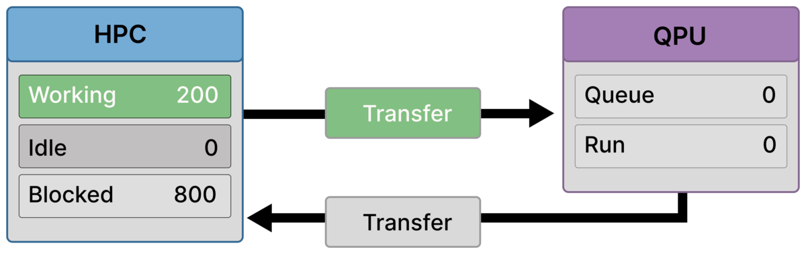
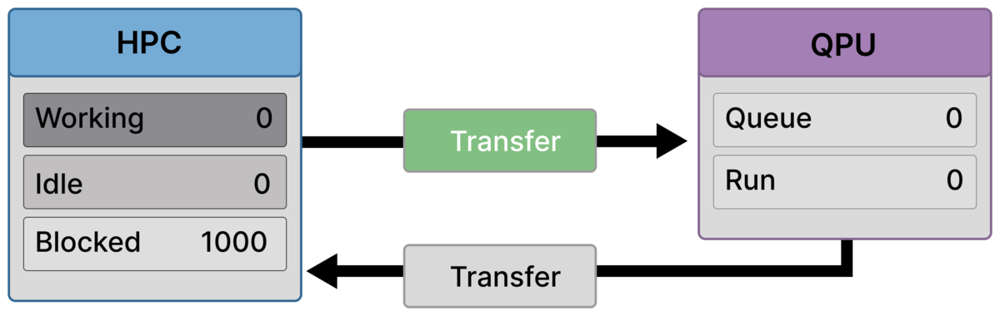
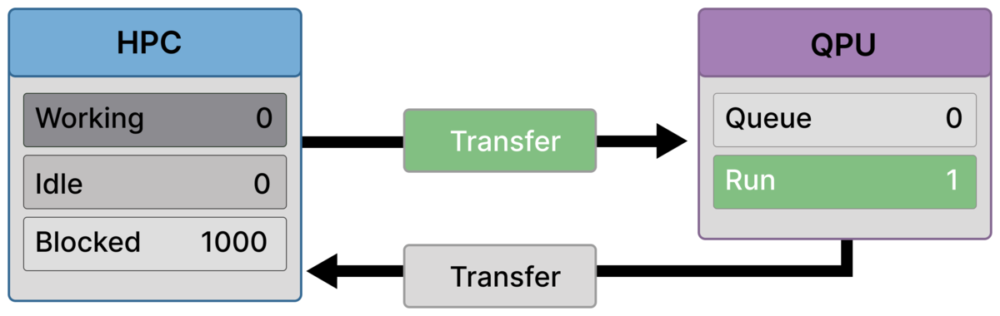

# Scenario C — Latency Wall (Transfer-Dominated Workflow)

Scenario C illustrates a hybrid Quantum–HPC workflow in which **data movement dominates execution time**.  
Classical preparation is fast, quantum execution itself is fast, and the QPU is not saturated — yet the system still stalls.

This scenario corresponds to **Bottleneck 1 (latency / data movement)** in the accompanying article.  
The performance collapse occurs **in the transfer path**, before backend capacity or synchronization limits become relevant.

---

## Purpose of This Scenario

Scenario C shows:

- How latency and data movement alone can dominate hybrid workflows
- Why classical parallelism does not translate into higher throughput
- How the QPU can remain idle while HPC ranks are blocked

Unlike Scenario B, **no global synchronization is enforced**.  
Unlike Scenario D, **queue buildup and throttling are not the cause**.

The bottleneck here is **transfer**, not computation.

---

## What characterizes this workflow

Scenario C follows a repeated execution pattern of the form:

- **Classical preparation and submission** (many ranks)
- **Transfer to and from the QPU** (dominant cost)
- **Independent classical continuation** once results return

Key characteristics:

- Many ranks submit quantum work quickly
- Classical preparation completes much faster than results can return
- Jobs spend most of their lifetime in the **transfer phase**
- The QPU is frequently idle, waiting for arrivals

Transfer dominates either because:
- round-trip latency is large (control-dominated regimes), or
- payload size is large (data-dominated regimes)

Both cases produce the same observable behavior: **blocked classical resources and underutilized quantum hardware**.

---

## Bottleneck

The dominant bottleneck in this scenario is **latency / data movement**.

- **Latency wall**  
  Classical ranks block waiting for quantum results that are delayed in transfer, even though the QPU itself is not busy.

This stall is caused by communication cost, not by synchronization or limited quantum service capacity.

---

## Assumptions and constraints

### Algorithmic structure
- Iterative hybrid loop
- Quantum results are consumed independently
- No global aggregation or barrier

### Timing regime
- Transfer time ≫ quantum execution time
- Transfer time ≫ classical step time
- Transfer cost is paid every iteration

### HPC execution
- Many ranks submit quantum work
- Off-load completes quickly
- Once submission is complete, ranks have no remaining independent work and are **Blocked** until results return

### Quantum execution
- Serialized execution model
- Jobs arrive intermittently
- QPU is often idle, waiting on transfers

Queue growth is **consequently minimal**:  
jobs are delayed during transfer and do not accumulate at the backend.

---

## Frame-by-Frame Walkthrough

### Frame 1 — First rank blocks while transfer begins (999 working / 1 blocked)

  

Most ranks are still in classical work (**Working = 999**), but one rank has already reached a dependency on its quantum result (**Blocked = 1**).  
Outbound transfer has started, while the QPU is still idle (**Queue = 0, Run = 0**).

This is the first visible sign of the latency wall: blocking can begin before the QPU sees any work.

---

### Frame 2 — Many ranks block while a minority still prepares/submits (200 working / 800 blocked)

  

Classical preparation finishes quickly for most ranks: **Blocked = 800**.  
A smaller group is still active on the HPC side (**Working = 200**), while outbound transfer remains active and the QPU is still idle.

This snapshot corresponds to a transfer sub-phase where many ranks have completed off-load and are waiting, while a minority is still finishing classical preparation.

---

### Frame 3 — Full stall before arrival (1000 blocked, QPU idle)

  

All ranks are blocked (**Blocked = 1000**), and none are working or idle.  
Transfer is still active, but the QPU remains idle (**Queue = 0, Run = 0**).

This is the core latency-wall moment: the entire HPC allocation is waiting while quantum hardware is not yet engaged.

---

### Frame 4 — First execution starts, but it’s still transfer-dominated (1000 blocked, QPU Run = 1)

  

A job finally arrives and begins executing (**Run = 1**), with no queue buildup (**Queue = 0**).  
The HPC remains fully blocked (**Blocked = 1000**), and outbound transfer is still active.

Quantum execution begins, but it does not relieve the stall because transfer and return latency still dominate the iteration.

---

### Frame 5 — One rank resumes while others remain blocked (1 working / 999 blocked)

  

One quantum result has returned and a single rank resumes classical work (**Working = 1**), while the remaining ranks are still waiting (**Blocked = 999**).  
Transfer remains active, and the QPU is currently idle (**Queue = 0, Run = 0**), consistent with a snapshot where return/next-transfer latency is dominating and execution is intermittent.

This illustrates the characteristic pattern of Scenario C: results trickle back slowly, unblocking ranks one-by-one (or in small numbers), while transfer continues to govern throughput.

---

## Why HPC parallelism does not help

In this regime:

- One rank behaves almost identically to one thousand
- Classical work completes faster than results can return
- Additional submitters only increase the number of blocked ranks

Without batching, co-location, or latency hiding, **parallelism amplifies waiting rather than throughput**.

---

## Where and why this scenario appears

Scenario C commonly appears in workloads listed in the table, including:

- **Monte Carlo–style hybrid loops**, where frequent state exchanges dominate runtime
- **Genomics and multi-omics pipelines**, where large intermediate representations must be transferred between classical and quantum stages
- **PDE or state-exchange workflows**, where repeated data movement outweighs quantum execution time
- **Fine-grained hybrid algorithms** with frequent remote quantum calls

In all cases, the defining feature is that **transfer cost dominates quantum compute**, regardless of whether that cost is driven by latency, bandwidth, or both.

---

## Takeaway

Scenario C demonstrates that **data movement alone can stall a hybrid system**, even when both classical and quantum execution are individually fast.

In transfer-dominated regimes, HPC resources provide little benefit unless communication costs are reduced, hidden, or amortized.