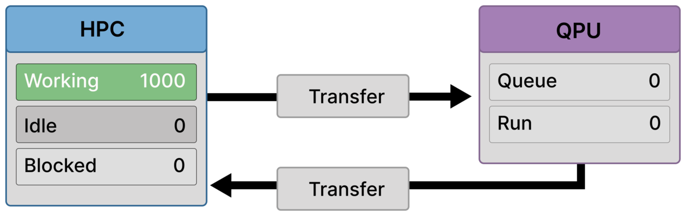
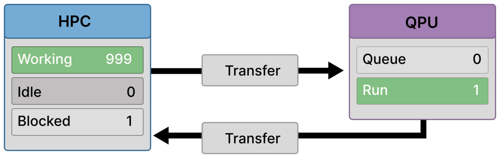
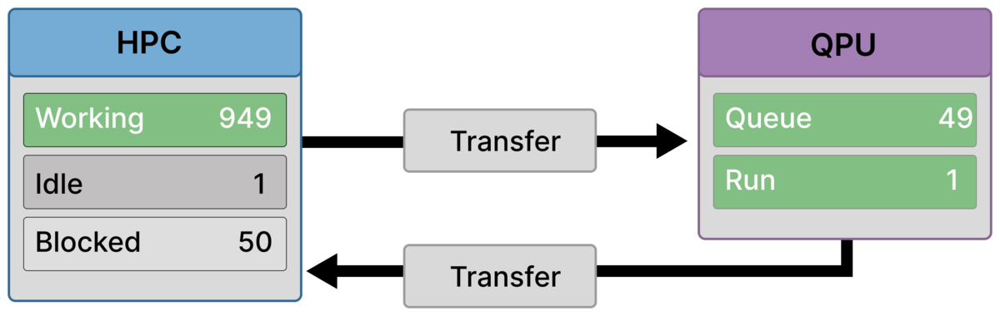
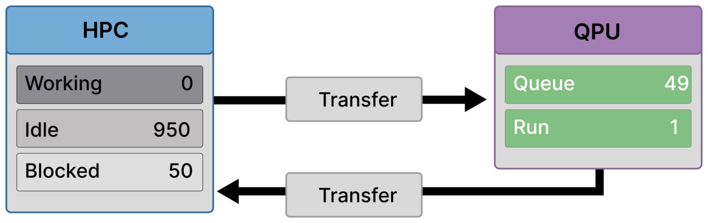
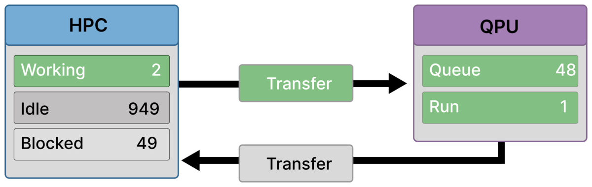

# Scenario D
## Throttled Execution (Throughput-Limited, Asynchronous Workflow)

Scenario D illustrates a hybrid Quantum–HPC workflow with **no global synchronization barrier**, where ranks progress independently but overall throughput is limited by the **serial service capacity of the QPU**.

Unlike Scenario B, ranks do not wait for a collective quantum result.  
Unlike Scenario C, transfer latency alone is not the dominant effect.

The defining feature here is **rate mismatch**: classical resources can generate quantum jobs faster than the backend can execute them. Throttling is introduced to keep this mismatch from producing unbounded queue growth.

This scenario corresponds to **Bottleneck 3 (serial service capacity)** in the accompanying article.

---

## Purpose of This Scenario

Scenario D shows:

- Why throughput limits matter even without synchronization
- How throttling converts an unstable workload into a steady pipeline
- How **Idle**, **Blocked**, and **Working** coexist in a controlled regime

It demonstrates that removing barriers does not remove bottlenecks — it merely changes their nature.

---

## What characterizes this workflow

Scenario D follows an asynchronous pattern:

- Ranks submit quantum jobs independently
- Each rank waits only for **its own** quantum result
- The QPU executes jobs serially (**Run = 1**)
- A throttling policy limits how many jobs may be outstanding

A critical modeling detail:

> **Transfer spans three phases** — off-load (HPC), in-flight, and on-load (QPU).  
> During off-load, a rank is **Working**; once off-load completes, the rank becomes **Blocked** while waiting for its result.

---

## Bottleneck

The dominant bottleneck in this scenario is **quantum service capacity**.

- **Capacity wall**  
  Progress is limited by how fast the QPU can complete jobs, not by synchronization or latency.

Throttling does not remove the bottleneck; it prevents it from destabilizing the system.

---

## Assumptions and constraints

### Algorithmic structure
- No global dependency across ranks
- Quantum results are consumed locally
- Many independent quantum calls over time

### Classical execution and throttling
- Classical work is abundant and parallel
- Submission is rate-limited by policy
- Ranks may be **Idle** even when work exists, purely due to throttling

### Quantum execution
- Single-lane backend execution
- Queue allowed but intentionally bounded

---

## Frame-by-Frame Walkthrough

### Frame 1 — All-classical baseline (1000 working)

  

All ranks are performing classical work (**Working = 1000**).  
No quantum jobs are running or queued (**Queue = 0, Run = 0**).

---

### Frame 2 — First local stall (999 working / 1 blocked)

  

One rank reaches a dependency on its own quantum result and becomes **Blocked = 1**.  
All other ranks continue working. The QPU begins execution (**Run = 1**).

Blocking is local, not global.

---

### Frame 3 — Bounded backlog forms (950 working / 50 blocked)

  

A steady backlog emerges: **Run = 1, Queue = 49**.  
A fixed cohort of ranks waits for results (**Blocked = 50**), while the remainder continue classical work (**Working = 950**).

This is the raw throughput limit made visible.

---

### Frame 4 — Throttling activates (949 working / 1 idle / 50 blocked)

  

With the queue at its limit, throttling prevents further submissions.  
One rank is now **Idle = 1** by policy, while **Blocked = 50** wait on results and **Working = 949** continue classical work.

Idle here reflects **admission control**, not lack of work.

---

### Frame 5 — Policy-held steady state (950 idle / 50 blocked)

  

Throttling fully dominates visible behavior: **Idle = 950**, **Blocked = 50**, **Working = 0**.  
The backend continues draining the bounded backlog (**Run = 1, Queue = 49**).

This is a controlled pause, not a deadlock.

---

### Frame 6 — Result returns, pipeline advances (2 working / 949 idle / 49 blocked)

  

One quantum job completes and its result returns.  
The corresponding rank becomes unblocked and resumes classical work using the returned quantum result.

Because the queue shortens (**Queue = 48**), throttling immediately releases one idle rank, which begins **off-loading the next quantum job** (active Transfer).  
This ranks is now also doing work (off-loading data) thus **Working = 2**.

This is the core pipeline step: *completion frees capacity, which is immediately reused*.

---

### Frame 7 — Off-load completes, steady backlog restored (1 working / 949 idle / 50 blocked)

  

The submitting rank completes off-load.  
It becomes **Blocked**, restoring the waiting cohort to **Blocked = 50** and the queue to its steady size (**Queue = 49, Run = 1**).

The cycle repeats: each returned result advances the pipeline by exactly one job. One idle rank is allowed to submit reducing the idle count by one. This repeats until all classical results have been submitted and the idle count is reduced to zero 

---

### Frame 8 — Late in the drain (950 working / 50 blocked)

  

Most quantum results have now returned.  
Previously idle ranks are actively working again (**Working = 950**), while a fixed cohort remains blocked (**Blocked = 50**) corresponding to the remaining bounded backlog.

The system is still throughput-limited, but classical utilization is largely restored.

---

### Frame 9 — Final result returns (1000 working)

  

The last outstanding quantum result returns.  
All ranks resume classical work (**Working = 1000**), and the QPU becomes idle (**Queue = 0, Run = 0**).

The next cycle will reproduce the same capacity-limited dynamics once submissions resume.

---

## Why throttling is essential

Without throttling:

- the queue would grow without bound
- memory pressure and control overhead would dominate
- performance would degrade unpredictably

Throttling transforms a pathological workload into a **stable, repeatable pipeline** whose throughput is explicitly capped by backend capacity.

---

## Where this scenario appears

Scenario D is representative of:

- High-throughput hybrid workflows
- Batched kernel evaluations
- Asynchronous quantum subroutines
- Any setting where quantum calls are independent but frequent

It reflects realistic execution on shared quantum backends with limited service rates.

---

## Takeaway

Scenario D shows that **asynchrony alone does not guarantee scalability**.

When quantum execution is serial, overall progress is capped by backend throughput.  
Throttling does not eliminate this bottleneck — it makes it visible, controllable, and survivable.