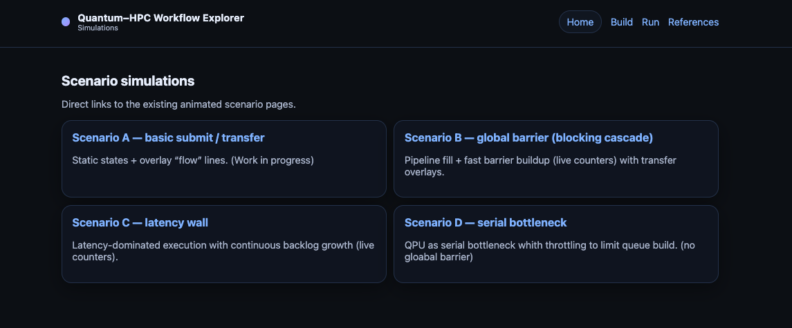
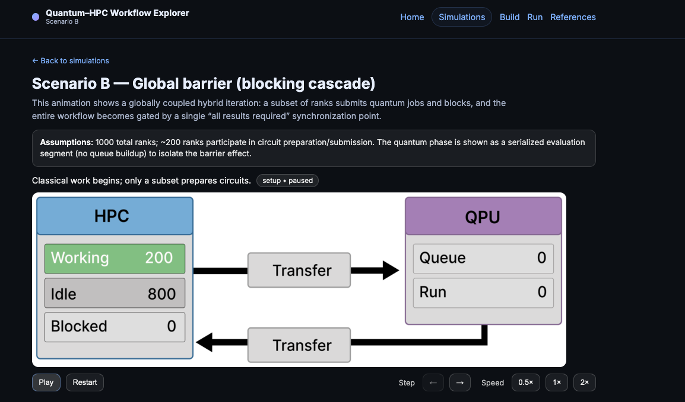

# Workflow Animations

This page collects the animated workflow scenarios discussed in the previous sections and presents them in a visual, time-resolved form.  
The animations do not introduce new concepts — they are meant to *make the already-explained workflows visible in motion*.

You can reach this page in several ways:
- via the **Simulations** button in the middle of the Workflow Explorer start page  
- via the **Simulations** link in the top navigation  
- (where available) directly from the individual workflow scenario explanation pages

---

## Why these animations exist

After studying the workflow scenarios step by step, it is often helpful to *watch the same process unfold over time*.

These animations serve two purposes:

1. **Reinforce understanding**  
   They visually connect the static diagrams and explanations from the previous sections to their dynamic behavior:  
   queue growth, idle ranks, blocking, synchronization points, and data transfers.

2. **Build intuition for your own applications**  
   By observing how different orchestration patterns behave, users can start recognizing scenarios that resemble their own workloads — even before modeling them explicitly in the Workflow Explorer.

---

## Scenario overview

The overview page lists all available workflow scenarios discussed earlier (Scenario A–D), each representing a distinct orchestration pattern.

Each scenario corresponds directly to a workflow analyzed in detail in the preceding documentation sections. The animations simply make those workflows *observable over time*.

---

## Example animation

Each scenario opens into an interactive animation that shows the workflow progressing step by step.

In these animations you can observe, for example:
- ranks transitioning between **working**, **idle**, and **blocked** states  
- queue buildup and release on the QPU side  
- data transfers becoming active when submissions or returns occur  

---

## How the animations work

To keep the animations informative without unnecessary waiting:

- **Single steps and key transitions** run more slowly  
- **Repetitive loop sections** are intentionally sped up  
- Counters update to reflect how many ranks or jobs are in each state  
- Transfer lines animate only when the corresponding transfer is active  

This allows long-running patterns to remain visible while keeping the overall runtime manageable.

---

## Relationship to the Workflow Explorer tool

These animations are the visual counterpart to the conceptual workflows introduced earlier.  
They prepare users for the next step: **parameterizing and exploring their own workflows** using the Workflow Explorer.

Details on building and running custom workflow models are covered in the dedicated Explorer pages.